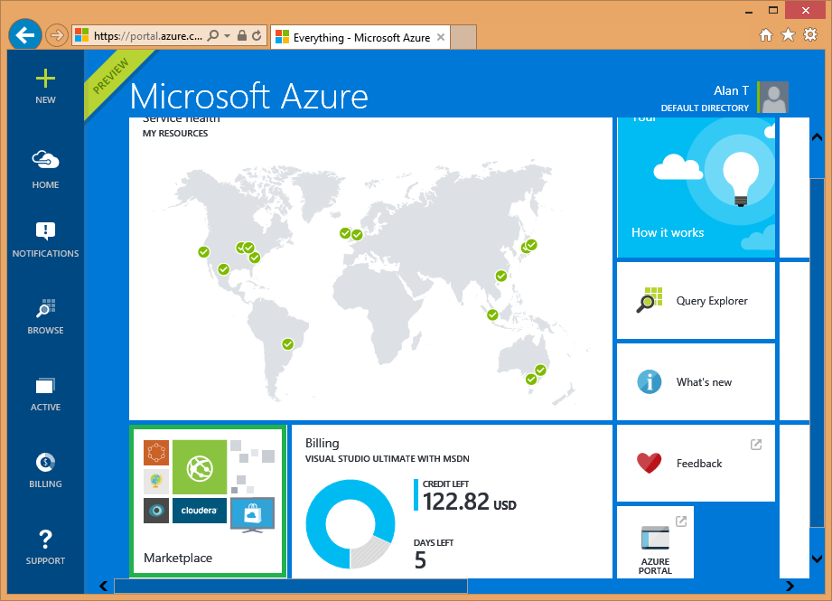
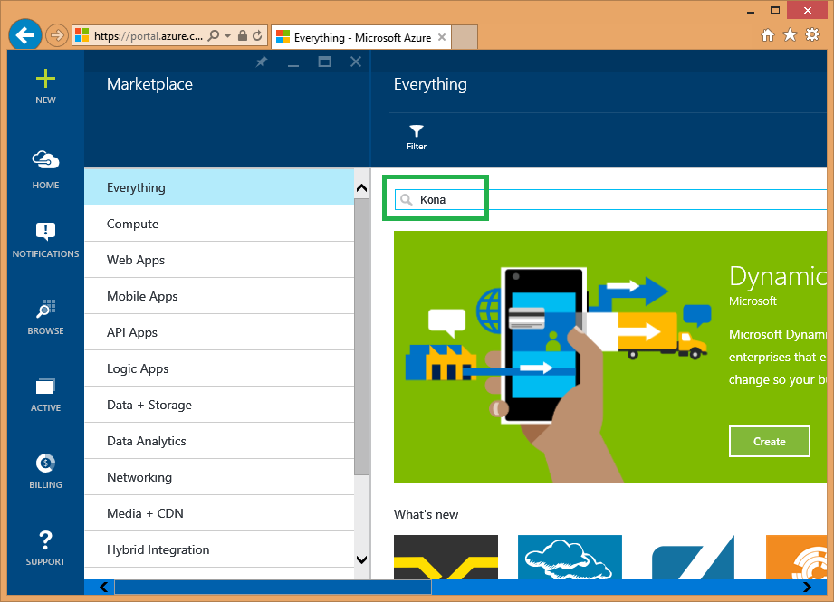
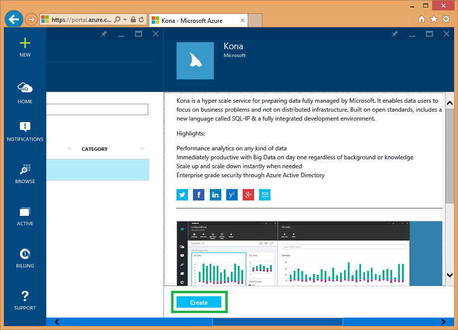

# First Steps: Portal for Kona and Data Lake

### First steps

To create a Kona or Azure Data Lake account:

1. If you were part of the Private Preview, please **go through the [Migration Guide](../Migration.md) first**.

1. Go to the new Azure Portal using [this link](https://portal.azure.com/signin/index/?Microsoft_Azure_Kona=true&Microsoft_Azure_DataLake=true&hubsExtension_ItemHideKey=AzureDataLake_BigStorage%2cAzureKona_BigCompute). The link has special keys which will let you search for Kona and Data Lake.

1. Click on Marketplace.

   

1. In the Search Bar, type either "Kona" or "Azure Data Lake".

   

1. Click Create.

   

### Known Errors ###
####Error registering resource providers####
#####Detailed error#####
Registering the resource providers has failed. Additional details from the underlying API that might be helpful: The resource namespace ("Microsoft.Kona" OR "Mirosoft.DataLake") is invalid.
#####What this means#####
This usually means the subscription you tried to use wasn't whitelisted. Send "konaonboard@microsoft.com" an email with the subscription ID you want to use and we will whitelist it.

### Useful links

Browse the following pages:

* [Getting Started](../GettingStarted.md)
* [Migration Guide](../Migration.md)
* Tools
    * [Azure Portal](../AzurePortal/FirstSteps.md)
    * [Kona PowerShell](../PowerShell/FirstSteps.md)
    * [SDK](../SDK/FirstSteps.md)
* Tutorials
    * [SQLIP Developer Guide](../SQLIP/DeveloperGuide)
    * [Terminology](../Terminology)
