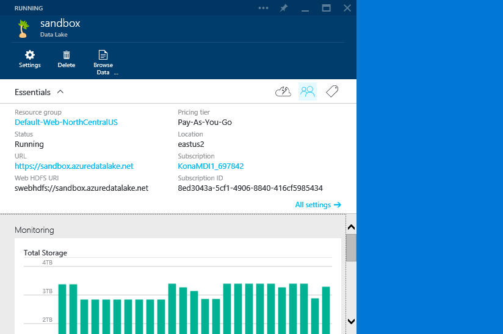

##Managing Azure Data Lake Users##
For Azure Data Lake, we're leveraging 2 components to secure access:

1) Portal and Management operations are controlled by [Azure RBAC](https://azure.microsoft.com/en-us/documentation/articles/role-based-access-control-configure/).

2) File System and Data operations are controlled by ACLs set on the Azure Data Lake. 

We will walk you through how to create a security group and use it to control access to both the Portal and Filesystem. Once you've added the security group, you can control access just by simply adding/removing users to the group.

###Setting Up Security Groups in AAD###
If you don't already have a Security Group that you can use, you can setup a new one by following these steps:

1) Navigate to your Azure Active Directory and Select it
 

2) Select the Directory you're using with your Kona and Azure Data Lake Service. If you're using a Corporate AAD, check with your IT Team on how you can manage/create Security Groups.

3) Click on "Groups" near the top of the screen

4) Click on the "Add Group" button at the bottom of the screen

5) Choose meaningful names that represent the level of permissions the group has.

6) Add users to this group using the "Add User" command at the bottom of the screen

###1. Managing Users for the Portal/Management Operations###
1) Open the Azure Data Lake service

2) Click on the User icon in the Essentials Bar

3) Click on the Add icon in the top command bar

4) Click on the "Contributor" role, basically this role restricts users from adding/removing other users. Definition for each role can be found in the [Azure RBAC](https://azure.microsoft.com/en-us/documentation/articles/role-based-access-control-configure/) guide.

5) Search for users or groups that you want to give access (eg. the group created above)

6) Click Select

7) Now this group has access to use the Portal and do management operations

###Managing Users for the File System###
At the moment we need to help you add the Group to the Data Lake access control list (in the future this can be done in the API/PS/UI). We need the Object ID of the group to do this.

To get the Object ID:

1) Click on the Group to see the Details of the Group

2) Click on Properties and copy the Object ID

3) Send us the following information to konaonboard@microsoft.com:
- Subscription ID
- Data Lake Account Name
- Object ID
- [Any additional information for Data Migration (see above)]

###Adding/Removing Users###
Now that the same security group has been added to both the Portal and the file system, you can simply add/remove users to the security group to manage access.
