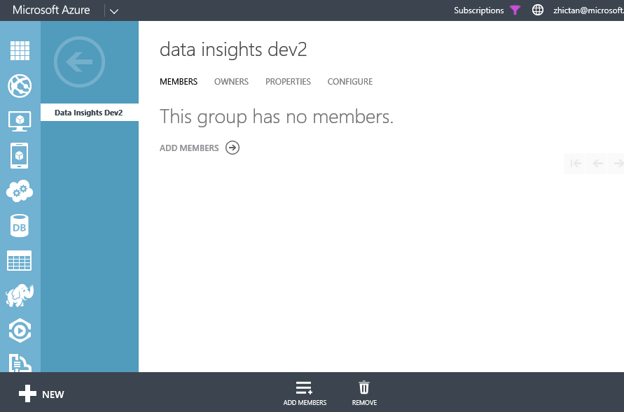
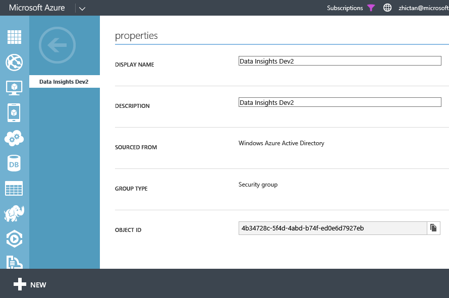

#Securing Kona and Azure Data Lake Best Practices

##Managing Users##
With the new accounts, we will be leveraging a combination of the [Azure RBAC](https://azure.microsoft.com/en-us/documentation/articles/role-based-access-control-configure/) and Filesystem ACLs to manage access.

Since we separated Kona and Data Lake, the access permissions for these services are managed separately. To simplify access management, we recommend using security groups.

###Setting Up Security Groups in AAD###
We recommend these steps to simplify access management:

1) Navigate to your Azure Active Directory and Select it
 

2) Select the Directory you're using with your Kona and Azure Data Lake Service. If you're using a Corporate AAD, check with your IT Team on how you can manage/create Security Groups.

3) Click on "Groups" near the top of the screen

4) Click on the "Add Group" button at the bottom of the screen

5) Choose meaningful names that represent the level of permissions the group has.

6) Add users to this group using the "Add User" command at the bottom of the screen

At the moment we need to help you add the Group to the Data Lake access control list. We need the Object ID of the group to do this.

To get the Object ID:

1) Click on the Group to see the Details of the Group

2) Click on Properties and copy the Object ID

3) Send us the following information to konaonboard@microsoft.com:
- Subscription ID
- Data Lake Account Name
- Object ID
- [Any additional information for Data Migration (see above)]

###Managing Users for Kona###
For Kona, we're leveraging [Azure RBAC](https://azure.microsoft.com/en-us/documentation/articles/role-based-access-control-configure/). You can refer to the guide for more information but the basic steps are:

1) Open the service

2) Click on the User icon in the Essentials Bar

3) Click on the Add icon in the top command bar

4) Click on the "Contributor" role, this role restricts users from adding/removing other users. Definition for each role can be found in the [Azure RBAC](https://azure.microsoft.com/en-us/documentation/articles/role-based-access-control-configure/) guide.

5) Search for users or groups that you want to give access (eg. the group created above)

6) Click Select

7) Now this group has access to the Kona Service

###Manging Users for Azure Data Lake###

