# Instructor-Led Lab: Introduction to U-SQL

# Introduction

The purpose of this lab is to give you a taste of the new Big Data query language, U-SQL and its cognitive extensions by taking you through the journey of analysis some documents and images.

# What is U-SQL?
U-SQL is the Big Data query language of the Azure Data Lake Analytics (ADLA) service. 

U-SQL evolved from an internal Microsoft Big Data query language called SCOPE. 
It combines a familiar SQL-like declarative language with the extensibility and programmability provided by C# types 
and the C# expression language, together with support for Big Data processing concepts such as "schema on reads", 
custom processors and reducers.

U-SQL is however not ANSI SQL nor is it Transact-SQL. For starters, its keywords such as SELECT have to be in UPPERCASE. 
U-SQL uses the C# type system. Within SELECT clauses, WHERE predicates, and so on, U-SQL uses C# expressions. 
This means the data types are C# types and use C# NULL semantics, and the comparison operators within a predicate 
follow C# syntax (e.g., `a == "foo"`).

The Azure Data Lake Analytics service includes some useful **cognitive libraries** that you can install that provides you with image and text processing capabilities, such as image tagging, OCR processing and keyphrase extraction.

#How do I write U-SQL?
In the current ADLA batch service, U-SQL is written and executed as a batch script. It follows the following general pattern: 

1.	Retrieve data from stored locations in rowset format. These stored locations can be:
	-	Files that will be schematized on read with EXTRACT expressions.
	-	U-SQL tables that are stored in a schematized format.
2.	Transform the rowset(s).
	-	You can compose script multiple transformations over the rowsets in an expression flow format.
3.	Store the transformed rowset data. You can:
	-	Store it in a file with an OUTPUT statement.
	-	Store it in a U-SQL table.

U-SQL also enables you to use data definition statements such as CREATE TABLE to create metadata artifacts.

# Prerequisites
To complete this lab you'll need:

- A web browser such as Microsoft Edge, Google Chrome that is able to load the Azure Portal.
- Access to an ADLA account (information on how to get access to an ADLA Account is provided to you by your instructor).

# Getting started

To get started with the lab, following these steps:

1. Open the address [http://portal.azure.com](http://portal.azure.com) in your webbrowser. 

2. Open the "All Resources" tab 

    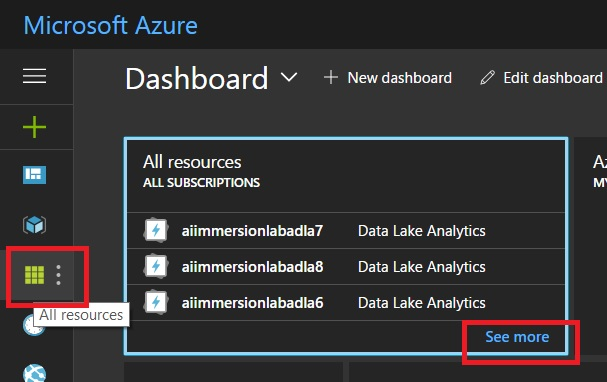

3. Search for the ADLA account that you have been given by the instructor and click on it:

    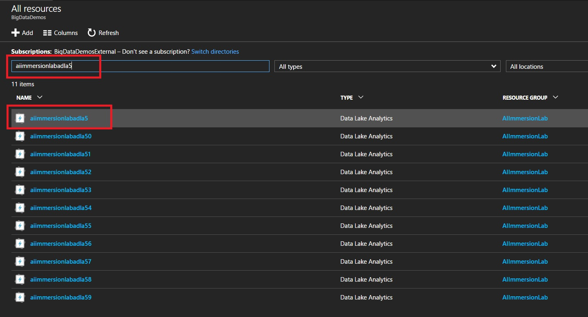

You should now see the ADLA Portal page.

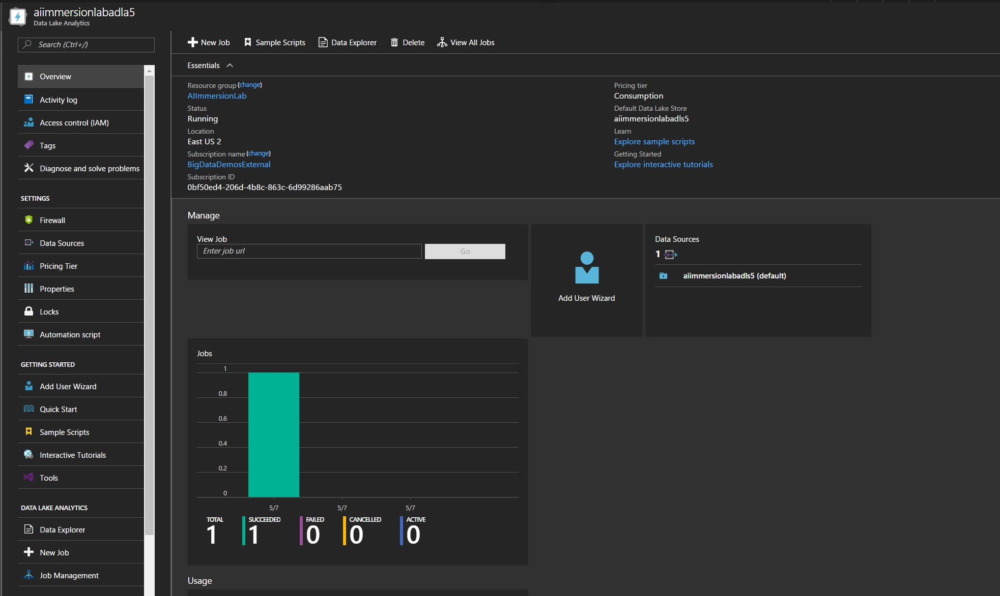

At the top of the page you will see - among others - the menus **New Job** and **Data Explorer** and details about the jobs that have been running on the account.
 
## Installing the Cognitive Libraries

In this lab, we will use the cognitive libraries that have been pre-installed on the adlhol main account. 

## Exploring the Sample data

The sample data consists of a subset of the Project Gutenberg public domain books in text format as well as some jpeg from the same source and some screen shots of some of the book pages. 

The files are already preloaded in the adlholadls account. So your scripts will reference the data directly from that account. 

You can see the files by following these steps:

1. In the still open "All Resources" tab, search for _adlholadls_ and click on it to open the account page.

    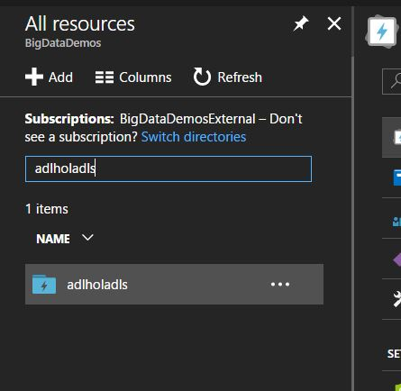

2. In the account page, open **Data Explorer** 

    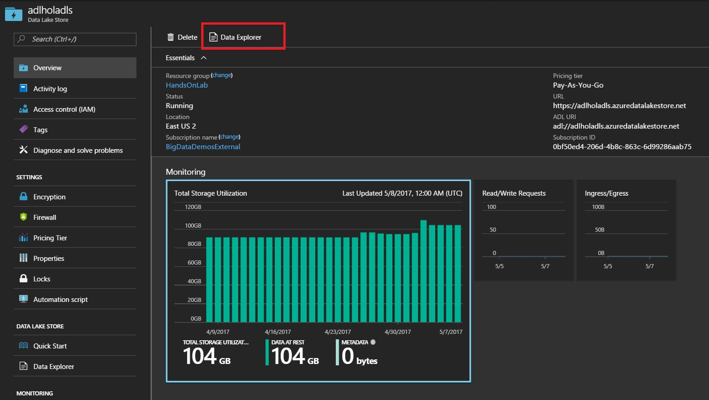

3. Navigate to `\Samples\Data\Books\Text_Small` to see the first set of books that we will look at:

    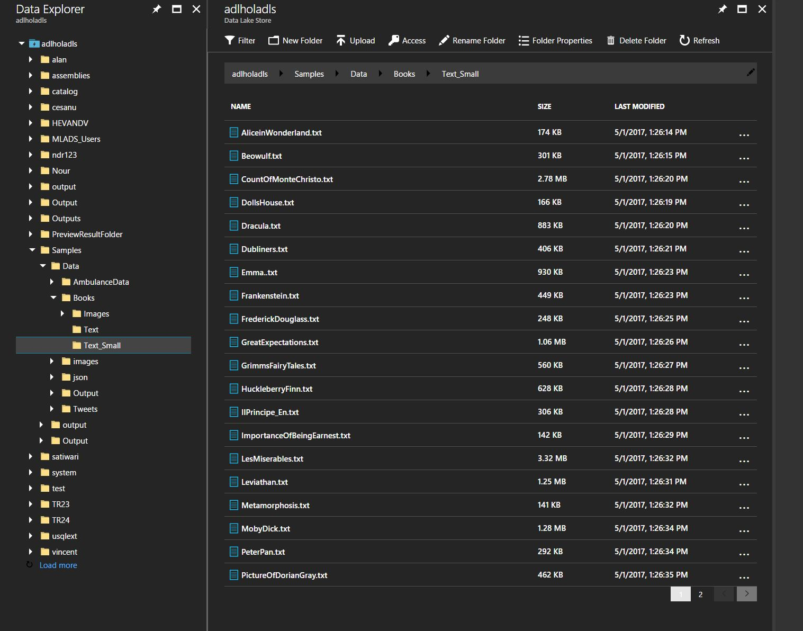

4. Clicking on the first book will open it in a file viewer:

    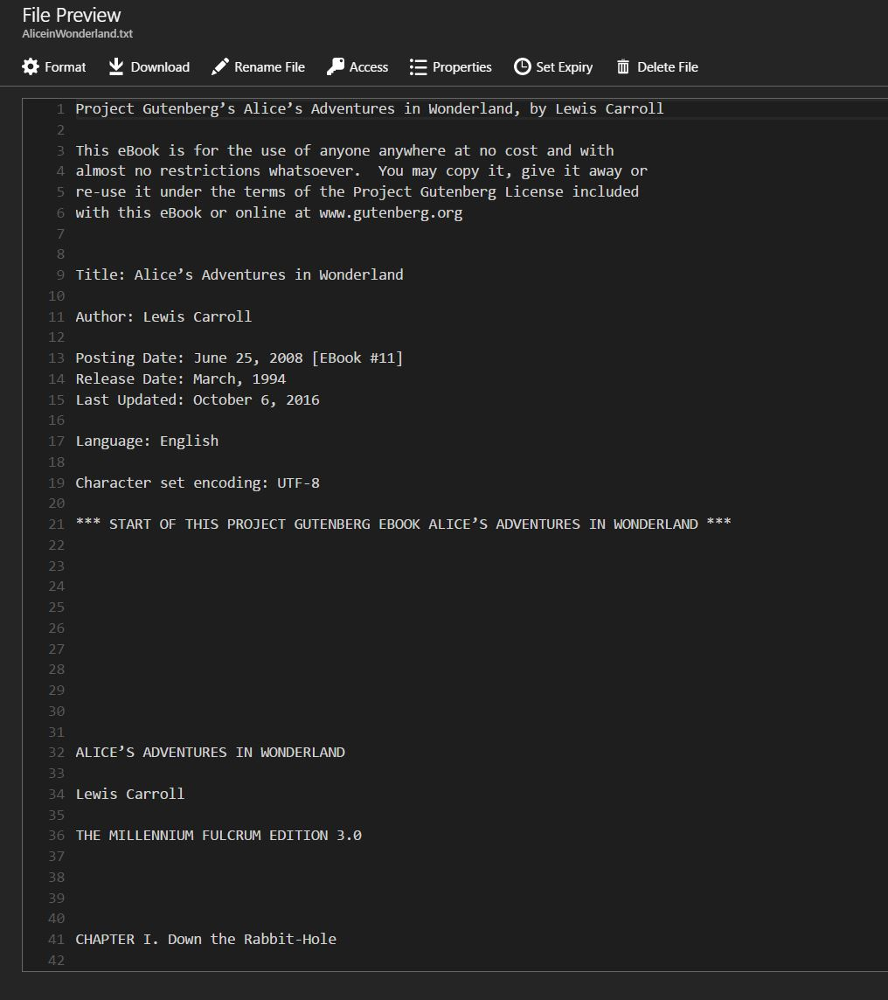

## Using the Azure Portal to submit U-SQL Job

Now open another browser window or tab and repeat the steps to open your assigned ADLA account. You then click on **New Job** to get the following job submission window:

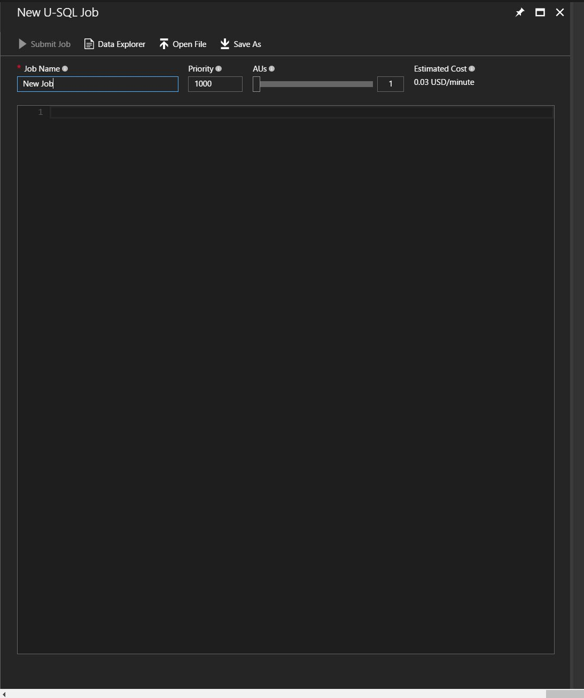
 
Now you are ready to start with the first exercise.

# Exercise 1: Extracting key phrases from the books

In this exercise you will submit a U-SQL script that schematizes the small book set using a custom extractor provided for the lab. The extractor parses each book into several rows containing author and title of the book and book parts that are small enough to fit into a U-SQL `string` typed column. The script then applies the cognitive libraries key phrase extraction processor, aggregates the key phrases into a combined list, and writes the results into an output file.

## Running the script

1. Copy the following U-SQL script into the "New U-SQL Job" window in the portal:

        REFERENCE ASSEMBLY adlhol.master.AIImmersion;
        REFERENCE ASSEMBLY adlhol.master.TextKeyPhrase;

        // Set a String size limit for the string aggregation value. 
        // Since we flow UTF-8, 128kB of Unicode is too big in the general case, so I set it a bit smaller 
        // since I assume we operate on mainly ASCII range characters.
        DECLARE @StringSz = 127 * 1024; 

        @books = 
          EXTRACT author string, title string, bookpart string 
          FROM "adl://adlholadls.azuredatalakestore.net/Samples/Data/Books/Text_Small/{*}.txt"
          USING new AIImmersion.BookExtractor();

        @keyphrases =
          PROCESS @books
          PRODUCE author,
                  title,
                  KeyPhrases string
          READONLY author,
                   title
          USING new Cognition.Text.KeyPhraseExtractor(txtCol : "bookpart", outCol : "KeyPhrases");
    
        @keyphrases =
          SELECT author,
                 title,
                 new string(String.Join(";", ARRAY_AGG(KeyPhrases)).Take(@StringSz).ToArray()) AS keyphrases
          FROM @keyphrases
          GROUP BY author,
                   title;

        OUTPUT @keyphrases
        TO "/output/keyphrases.csv"
        USING Outputters.Csv(outputHeader : true);

2. Select the number of AUs for the job with the slider. Since the job operates on about 30 files, any of the following numbers make sense: 10, 15, 30.
3. 
3. To submit your script, click the **Submit Job** button at the top-left of the window.

	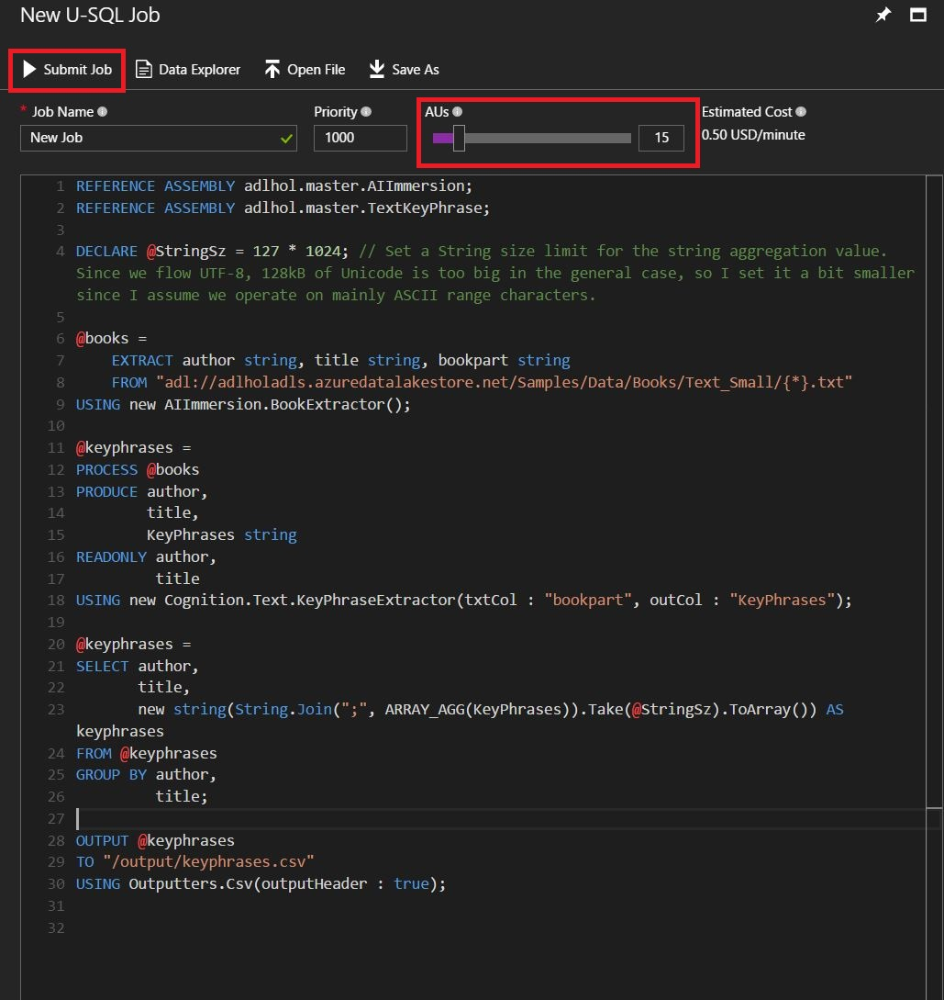

	After a short while, the Job View of the submitted job should appear. 

	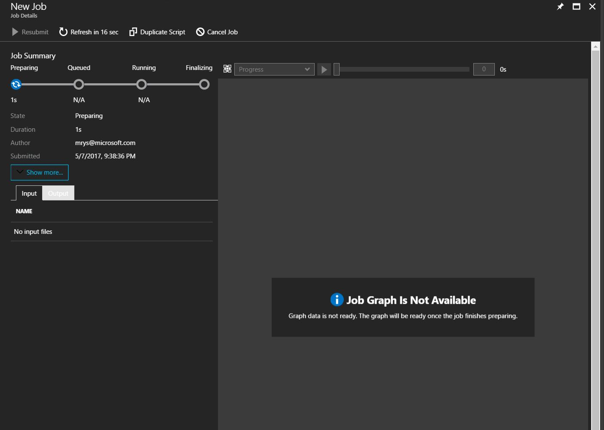

    After some time the Job View will show progress:

	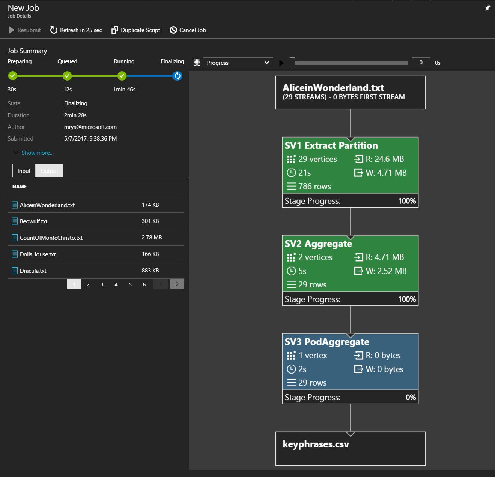

4. Wait until the job has completed. 

	If the job fails, please look at the **Error** tab and correct the mistake. 

5. Finally check the result by opening the resulting file, by clicking on the "Output" tab and the `keyphrases.csv` filename.

	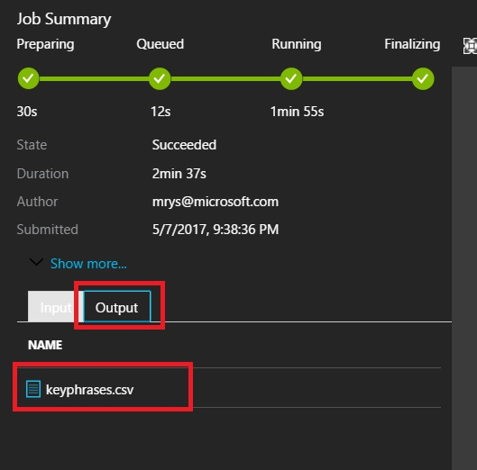

	The resulting file should resemble the following:

	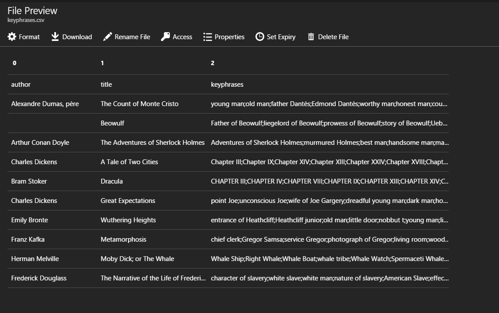
	
This script illustrates the following concepts:

- *Rowset variables*. Each query expression that produces a rowset can be assigned to a variable. Variables in U-SQL follow the T-SQL variable naming pattern of an ampersand (@) followed by a name (such as **@books** in this case). Note that the assignment statement does not execute the query. It merely names the expression and gives you the ability to build-up more complex expressions.

- *The EXTRACT expression*. This gives you the ability to define a schema as part of a read operation. For each column, the schema specifies a paired value consisting of a column name and a C# type name. It uses a so-called extractor, which can be built-in or created by the user. In this case  we are using a user-defined extractor called **AIImmersion.BookExtractor()** that is provided by the U-SQL Assembly **adlhol.master.AIImmersion**.

- *U-SQL file set*. The extractor reads from a file and generates a rowset. If you specify a wild-card pattern in the file name of the EXTRACT expression, then the set of files that match the pattern will be passed to the extractor. In this case the pattern is specified as `adl://adlholadls.azuredatalakestore.net/Samples/Data/Books/Text_Small/{*}.txt` and selects all the files in the specified directory ending with `.txt`.

- *Cross account access*. Both the U-SQL assemblies and the files are stored in different ADLA and ADLS accounts respectively. You can use the ADLA account name and the ADLA database name in that account to reference the U-SQL assembly, assuming you have read permissions. And you can fully qualify the URI for the files, assuming you have access to the store and RX permissions on the folders and files in the path.

- *Cognition library processor*. The `PROCESS` expression applies the cognition library keyphrase extraction processor on each of the book parts. It takes the name of the input column and the name of the output column as arguments. Since the other columns in the rowset are not being processed by the keyphrase extraction processor, they have to be marked as `READ ONLY` so they are passed-through to the result.

- *The OUTPUT statement*. This takes a rowset and serializes it as a comma-separated file into the specified location. Like extractors, outputters can be built-in or created by the user. In this case we are using the built-in **Csv** (comma-separated value) outputter provided by the Outputters class and specify that we want to also output the column names as headers.

# Exercise 2: Using Image Processing OCR

In this exercise, you will use the cognition library's image OCR capability to extract the text from a set of images and apply the keyphrase extraction on it.

## Running the script

1. Copy the following U-SQL script into the "New U-SQL Job" window in the portal:

	    REFERENCE ASSEMBLY adlhol.master.ImageCommon;
        REFERENCE ASSEMBLY adlhol.master.ImageOcr;
        REFERENCE ASSEMBLY adlhol.master.TextKeyPhrase;

        SET @@FeaturePreviews = "FileSetV2Dot5:on";

        @images = 
          EXTRACT filename string, image byte[] 
          FROM "adl://adlholadls.azuredatalakestore.net/Samples/Data/Books/Images/{filename}.jpg" 
          USING new Cognition.Vision.ImageExtractor();

        @ocr =
          PROCESS @images
          PRODUCE filename,
                  ocr_text string
          READONLY filename
          USING new Cognition.Vision.OcrExtractor(imgCol : "image", txtCol : "ocr_text");

        @ocr =
          SELECT filename,
                 ocr_text.Replace('\r', ' ').Replace('\n', ' ') AS ocr_text
          FROM @ocr;

        OUTPUT @ocr
        TO "/output/image_ocr.csv"
        USING Outputters.Csv(outputHeader : true, quoting:true);

        @ocr_keyphrases =
          PROCESS @ocr
          PRODUCE filename,
                  keyphrases string
          READONLY filename
          USING new Cognition.Text.KeyPhraseExtractor(txtCol : "ocr_text", outCol : "keyphrases");

        OUTPUT @ocr_keyphrases
        TO "/output/ocr_keyphrases.csv"
        USING Outputters.Csv(outputHeader : true);
  
2. As before, set the number of Analytics Units (AUs) and submit it. Since we are approximately processing over 900 files, you should use 90 or 100 to get a reasonable scale out.

	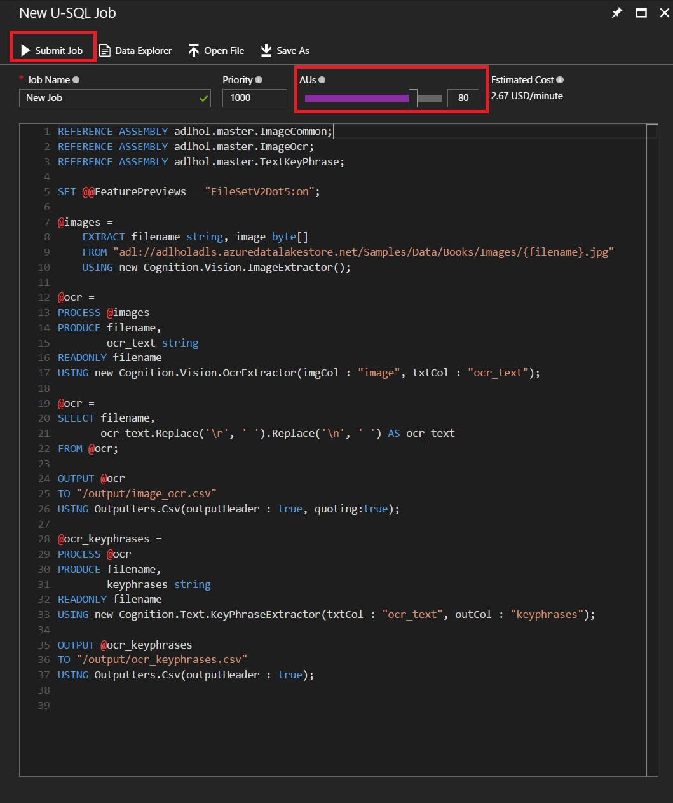

3. As in Exercise 1, wait for the job to complete and verify the results. Note that this job will run for several minutes.

    The successful submission will look like:

	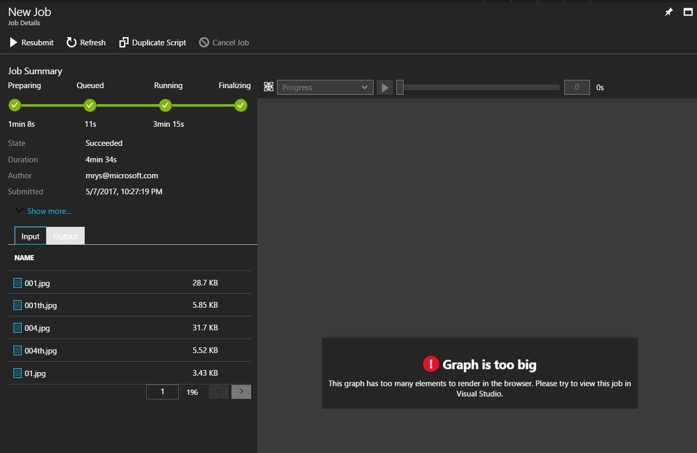

    As you notice, the job graph is too large for the portal to show. Here is how the job graph looks like in Visual Studio:

	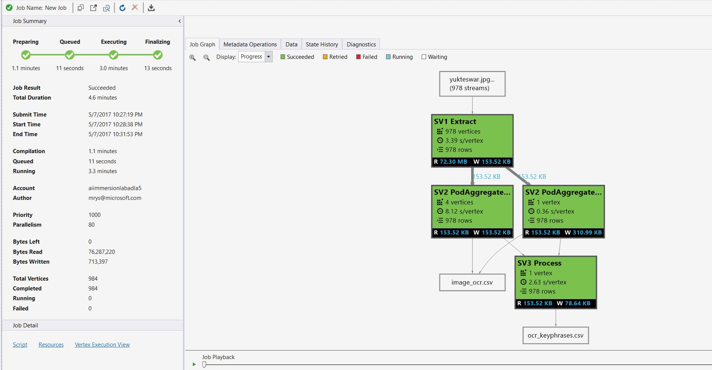

    The script produces two result files, one containing the OCR extracted text in `image_ocr.csv` and the other containing the keyphrase extraction on it in `ocr_keyphrases.csv`:

	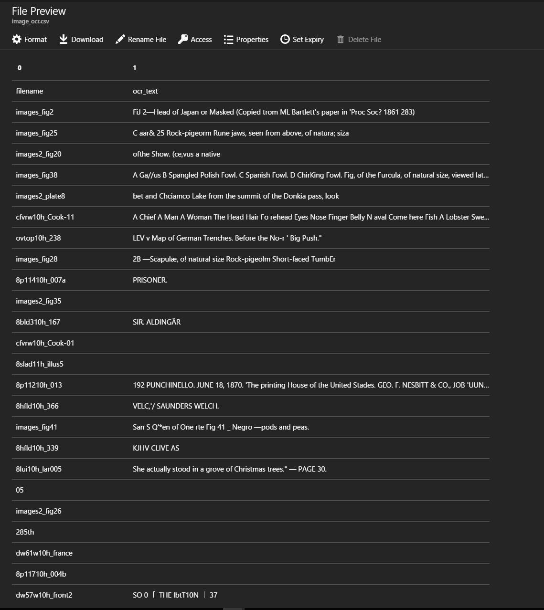

	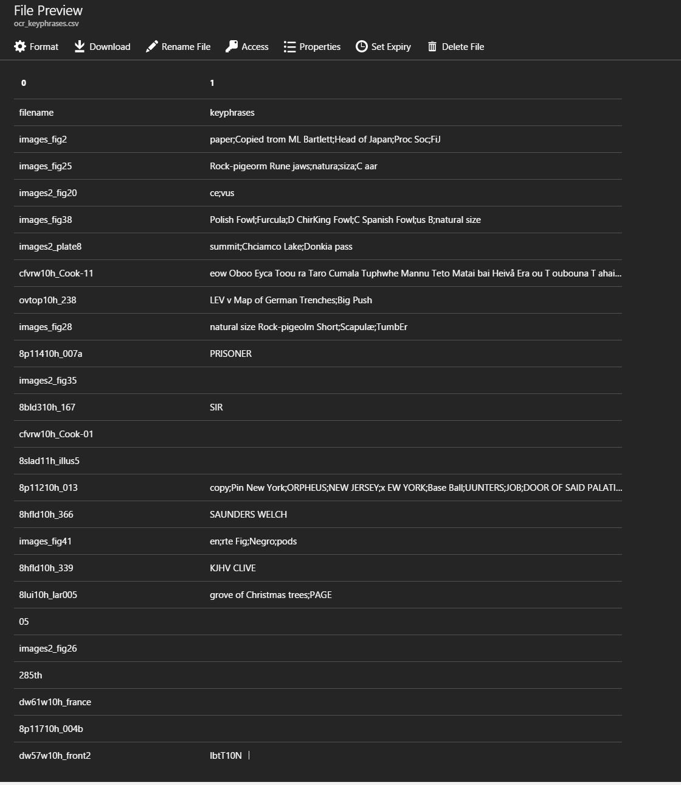

# Exercise 3: Finding potentially related images and books

In this exercise, we will combine the two previous exercises and find potentially related images and books. Instead of reading the books' keyphrases from the files, we will use a predefined table that contains the book authors, titles and their related keyphrases in rows, one row per keyphrase per book and author.

## Running the script

1. Copy the following U-SQL script into the "New U-SQL Job" window in the portal:

        REFERENCE ASSEMBLY adlhol.master.ImageCommon;
        REFERENCE ASSEMBLY adlhol.master.ImageOcr;
        REFERENCE ASSEMBLY adlhol.master.TextKeyPhrase;

        SET @@FeaturePreviews = "FileSetV2Dot5:on";

        @images = 
          EXTRACT filename string, image byte[] 
          FROM "adl://adlholadls.azuredatalakestore.net/Samples/Data/Books/Images/{filename}.jpg" 
          USING new Cognition.Vision.ImageExtractor();

        @ocr =
          PROCESS @images
          PRODUCE filename,
                  ocr_text string
          READONLY filename
          USING new Cognition.Vision.OcrExtractor(imgCol : "image", txtCol : "ocr_text");
     
        @ocr =
          SELECT filename,
                 ocr_text.Replace('\r', ' ').Replace('\n', ' ') AS ocr_text
          FROM @ocr;
    
        @ocr_keyphrases =
          PROCESS @ocr
          PRODUCE filename,
                  keyphrases string
          READONLY filename
          USING new Cognition.Text.KeyPhraseExtractor(txtCol : "ocr_text", outCol : "keyphrases");

        @ocr_keyphrases =
          SELECT filename,
                 keyphrase
          FROM @ocr_keyphrases
               CROSS APPLY
                 EXPLODE(keyphrases.Split(';')) AS K(keyphrase);

        @common =
          SELECT b.title AS book_title,
                 i.filename AS image_title,
                 b.keyphrase
          FROM adlhol.AIImmersion.dbo.BookKeyPhrases AS b
               JOIN
               @ocr_keyphrases AS i
               ON b.keyphrase == i.keyphrase;

        @common_summary =
          SELECT book_title,
                 image_title,
                 String.Join(",", ARRAY_AGG(keyphrase)) AS matches,
                COUNT( * ) AS match_count
          FROM @common
          GROUP BY book_title, image_title;

        OUTPUT @common_summary 
        TO "/output/common_summary.csv"
        ORDER BY match_count DESC
        USING Outputters.Csv(outputHeader : true);

   2. As before, set the number of Analytics Units (AUs) and submit it. Since we are approximately processing over 900 files, you should use 90 or 100 to get a reasonable scale out.

	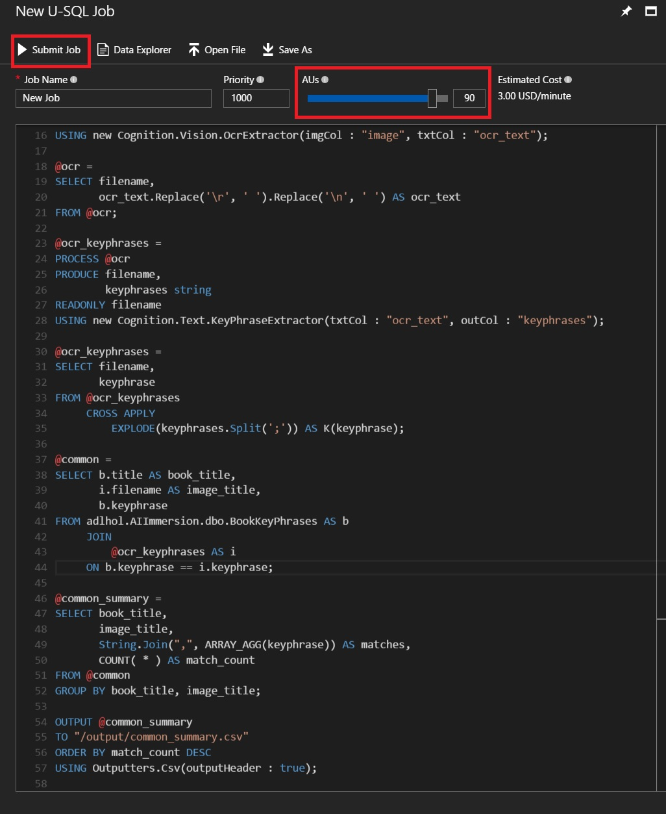

3. Wait for the job to complete and verify the results. Note that this job will run for several minutes.

    The successful submission will look like:

	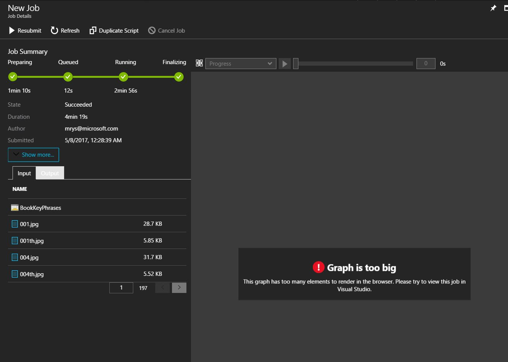

    As you notice, the job graph is too large for the portal to show. Here is how the job graph looks like in Visual Studio:

	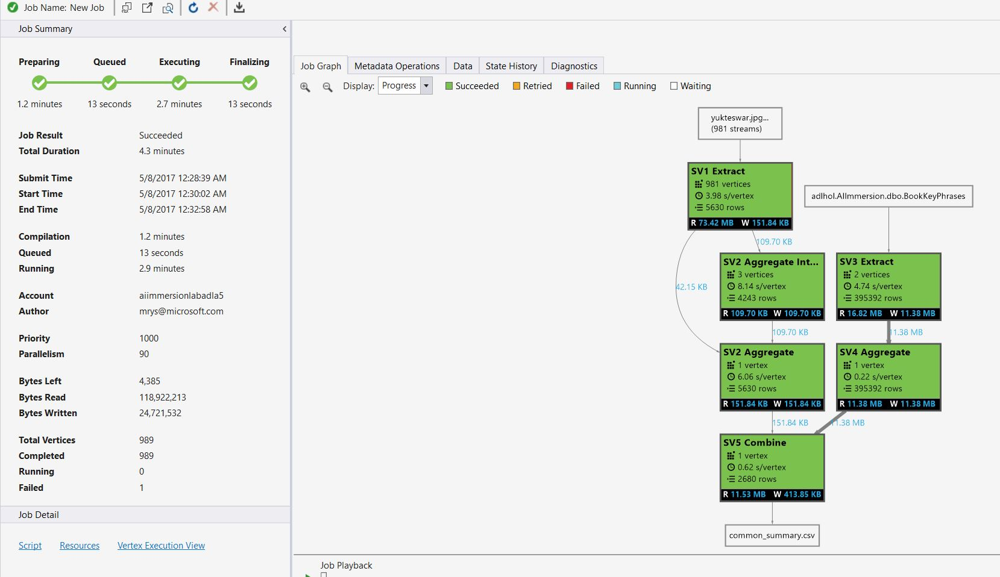

    The script produces a result file that contains for each matching book and image combination the concatenated list of matching keyphrases as well as the count of matches:

	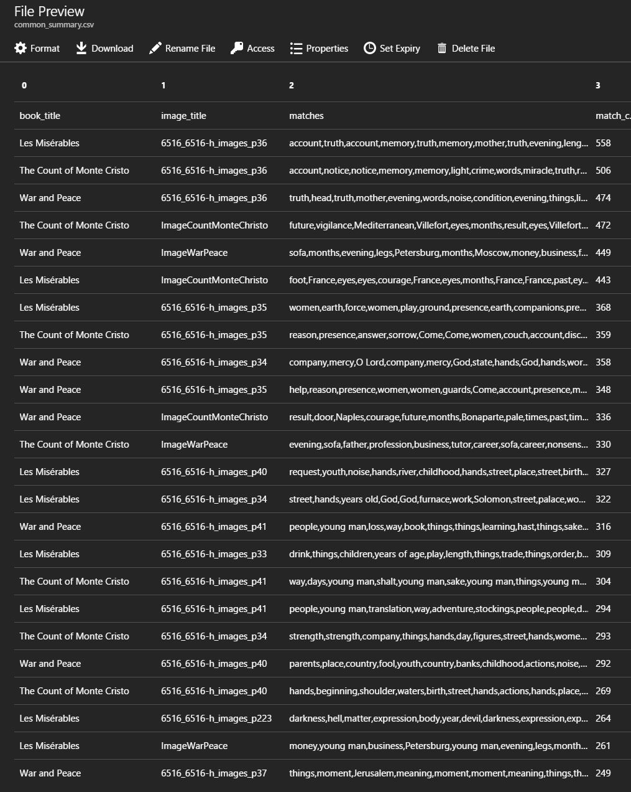

The above query used a `JOIN` expression. When you work with joins in U-SQL, note that:

- U-SQL only supports the ANSI-compliant JOIN syntax (*Rowset1* JOIN *Rowset2* ON *predicate*). The older syntax (FROM *Rowset1*, *Rowset2* WHERE *predicate*) is not supported.
- The predicate in a JOIN has to be an equality join and no expression. If you want to use an expression, add it to the SELECT clause of a previous rowset. If you want to do a different comparison, you can move it into the WHERE clause. If no predicate is left for the `ON` clause, turn the join into a `CROSS JOIN`. 

U-SQL requires this manual rewrite to make it explicit where the cost is when joining two data sets. Currently only equijoins have more efficient processing than a cross join with filters.

# Conclusion and more Information

This lab has hopefully given you a small taste of U-SQL and its cognitive capabilities. As you would expect, there are many more advanced features that this lab cannot cover.

You can find further references and documentation at the following locations:

- [Data Lake homepage (with links to documentation)](http://www.azure.com/datalake)
- [U-SQL Reference documentation](http://aka.ms/usql_reference)
- [ADL Tools for VS download page](http://aka.ms/adltoolsVS)
- [Data Lake feedback page](http://aka.ms/adlfeedback)

We hope you come back and use Azure Data Lake Analytics and U-SQL for your Big Data processing needs!
