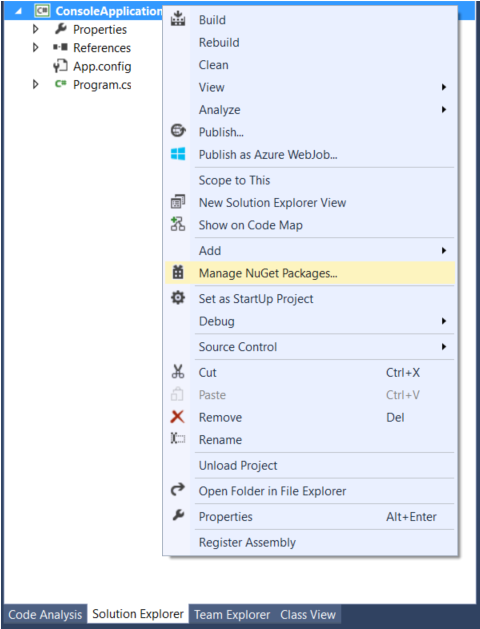
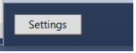
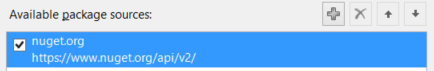
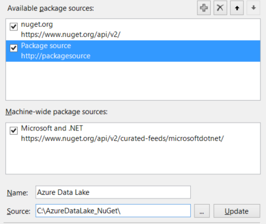
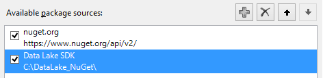
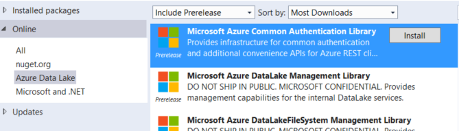

# First steps: Azure Data Lake .NET SDK

This guide assumes you have previously followed the steps in the main [Getting Started guide](../GettingStarted.md).

------------

### First steps

#### Download the Azure Data Lake .NET SDK NuGet packages
To download the Azure Data Lake .NET SDK NuGet packages, click here.

#### Extract and place in the desired directory
Extract the contents of the .zip file.

Place the contents in a directory, e.g. ``C:\NuGet\...``

#### Add NuGet packages to your .NET project in Visual Studio
Either open or create a .NET project in Visual Studio.

Add the NuGet packages to your project:

1. Right-click on your project in the Solution Explorer and select "Manage NuGet Packages...":

    

1. Click "Settings":

    

1. Click the "+" button to add a new NuGet source:

    

1. Enter the information below for the new source:

    * Name: Azure Data Lake
    * Source: C:\AzureDataLake_NuGet\

        Note: Use the path where you placed the NuGet packages initially.

    

1. Click "Update".
 
       You should now see the new source in the source list:
    
    

1. Click OK.
    
       You should now be able to select Azure Data Lake from your list of NuGet sources.
    
    

1. Select "Include Prerelease" from the dropdown.

1. Click "Install" on any/all Azure Data Lake packages that you would like to use with your project.

    You're done!

#### Learn more
* [SDK Tutorials](Tutorials.md) - Learn how to write some basic code using the Azure Data Lake .NET SDK.
* [SDK User Manual](UserManual.md) - View some basic documentation for the Azure Data Lake .NET SDK.

------------

### Useful links

Browse the following pages:

* *(place table of contents here)*